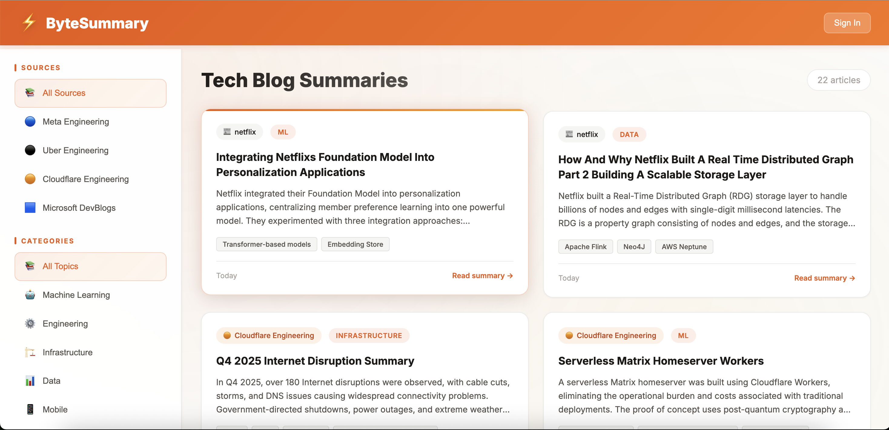

# ByteSummary - AI-Powered Tech Blog Aggregator

> *"TL;DR as a Service — turning essays into espresso shots."* ☕

A modern web application that automatically fetches and summarizes tech blog posts from major engineering teams using Cloudflare's AI infrastructure. Features user authentication and custom blog source support.


## 🌐 Live Demo

**[https://bytesummary-worker.praj-ddf.workers.dev](https://bytesummary-worker.praj-ddf.workers.dev)**

## 🚀 Features

### Blog Aggregation
- **Multi-Source Fetching**: Automatically aggregates blogs from:
  - 🔵 Meta Engineering
  - ⚫ Uber Engineering
  - 🟠 Cloudflare Engineering
  - 🟦 Microsoft DevBlogs
- **Custom Sources**: Logged-in users can add their own blog sources
- **Smart Parsing**: Extracts articles from RSS feeds and HTML pages

### AI Summarization
- **Powered by Llama 3.1-8B**: Uses Cloudflare Workers AI for summarization
- **Structured Output**: Each summary includes:
  - Brief summary (1-2 sentences)
  - Detailed summary
  - Key points (bullet list)
  - Technologies mentioned

### User Experience
- **Beautiful UI**: Modern orange-themed light design
- **Filtering**: Filter by source, category, and timeframe
- **Job Status Panel**: Real-time progress tracking during fetches
- **Toast Notifications**: Visual feedback for user actions
- **Responsive Design**: Works on desktop and mobile

### User Authentication
- **Register/Login**: Per-user accounts with session management
- **Custom Sources**: Add and manage your own blog sources
- **Source Filtering**: Custom sources appear in the filter list

## 🏗️ Architecture

| Component | Technology | Purpose |
|-----------|------------|---------|
| **LLM** | Workers AI (Llama 3.1-8B) | Content summarization |
| **Backend** | Cloudflare Workers | API routing, blog fetching |
| **Frontend** | Static Assets | Modular HTML/CSS/JS |
| **Storage** | Workers KV | Summaries, users, sessions (30-day TTL) |
| **Scheduling** | Cron Triggers | Daily automatic fetches (6 AM UTC) |

## 📁 Project Structure

```
cf_ai_ByteSummary/
├── src/
│   ├── index.js                 # Main entry point (routing)
│   ├── config/
│   │   └── constants.js         # Blog sources, categories, headers
│   ├── handlers/
│   │   ├── auth.js              # Register, login, logout, session
│   │   ├── blogs.js             # Blog API endpoints
│   │   └── sources.js           # User custom sources CRUD
│   ├── services/
│   │   ├── ai.js                # AI summary generation
│   │   ├── fetcher.js           # Built-in source parsers
│   │   ├── genericFetcher.js    # Custom source parser
│   │   └── processor.js         # Blog processing orchestration
│   └── utils/
│       ├── auth.js              # Password hashing, session helpers
│       ├── content.js           # HTML content extraction
│       └── http.js              # CORS, JSON response helpers
├── public/
│   ├── index.html               # HTML structure
│   ├── css/
│   │   └── styles.css           # All styles
│   └── js/
│       └── app.js               # All JavaScript
├── wrangler.toml                # Cloudflare Worker config
├── package.json                 # Dependencies
└── README.md                    # This file
```

## 🔌 API Endpoints

### Authentication
| Endpoint | Method | Description |
|----------|--------|-------------|
| `/api/auth/register` | POST | Create new account |
| `/api/auth/login` | POST | Login to account |
| `/api/auth/logout` | POST | Logout (clear session) |
| `/api/auth/me` | GET | Get current user |

### Blogs
| Endpoint | Method | Description |
|----------|--------|-------------|
| `/api/blogs` | GET | Get blog summaries (with filters) |
| `/api/blogs/:id` | GET | Get single blog detail |
| `/api/blogs/sources` | GET | List available sources |
| `/api/blogs/categories` | GET | List categories |
| `/api/refresh` | POST | Trigger blog fetch |
| `/api/job-status` | GET | Get fetch job status |
| `/api/clear-cache` | POST | Clear all cached summaries |

### Custom Sources (authenticated)
| Endpoint | Method | Description |
|----------|--------|-------------|
| `/api/user/sources` | GET | Get user's custom sources |
| `/api/user/sources` | POST | Add custom source |
| `/api/user/sources/:id` | DELETE | Remove custom source |

## 🛠️ Setup

### Prerequisites
- Node.js 18+
- Cloudflare account
- Wrangler CLI

### 1. Clone and Install

```bash
git clone <repo-url>
cd cf_ai_ByteSummary
npm install
```

### 2. Login to Cloudflare

```bash
npx wrangler login
```

### 3. Create KV Namespace

```bash
# Production namespace
npx wrangler kv namespace create SUMMARIES_CACHE

# Preview namespace
npx wrangler kv namespace create SUMMARIES_CACHE --preview
```

### 4. Update wrangler.toml

Replace the KV namespace IDs:

```toml
[[kv_namespaces]]
binding = "SUMMARIES_CACHE"
id = "your-production-id"
preview_id = "your-preview-id"
```

### 5. Run Locally

```bash
npm run dev
```

Opens at `http://localhost:8787`

### 6. Deploy

```bash
npm run deploy
```

## 📸 Screenshot



## 📋 How It Works

1. **Scheduled Fetch**: Cron job runs daily at 6 AM UTC
2. **Source Parsing**: Each source has a custom parser (RSS/HTML)
3. **Content Extraction**: Extracts article text from blog pages
4. **AI Summarization**: Sends content to Llama 3.1-8B for summary
5. **KV Storage**: Stores summaries with 30-day TTL
6. **Frontend Display**: Renders cards with filtering support

## 🔧 Adding New Built-in Sources

Edit `src/config/constants.js`:

```javascript
export const BLOG_SOURCES = {
  // ... existing sources
  newSource: {
    name: 'New Tech Blog',
    url: 'https://example.com/blog',
    logo: '🆕',
    color: '#123456'
  }
};
```

Then add a parser in `src/services/fetcher.js`.

## 📝 License

MIT License

## 🙏 Acknowledgments

- [Cloudflare Workers AI](https://developers.cloudflare.com/workers-ai/)
- [Cloudflare Workers](https://developers.cloudflare.com/workers/)
- [Cloudflare KV](https://developers.cloudflare.com/kv/)
